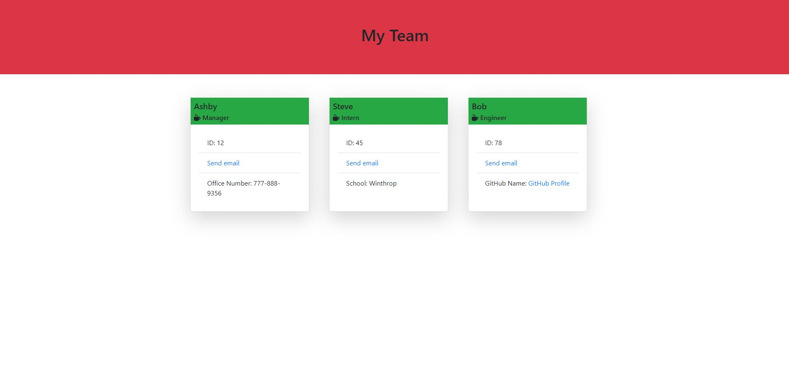

# Team Profile Generator 
    
## Description
use this application to generate a team profile page with your teams info.

## Table of Contents
- [Usage](#Usage)
- [Installation](#Installation)
- [Usage](#Usage)
- [Contributing](#Contributing)
- [Tutorial](#Tutorial)
- [Screenshot](#Screenshot)
- [License](#License)
- [Questions](#Questions)

## Usage
You can use this program to quickly and effeciently create an HTML page based on your feedback when prompted to respond to questions in the terminal. 

## Installation
In the programs lib dir, use node to begin the program.  node script.js

## Contributing 
Ashby Blakely 

## Tutorial
[Video Walkthrough](https://drive.google.com/file/d/1lCxqV2jz8PY1MmRP5pMHFgsZ69DqRraI/preview)

## Screenshot

## License
MIT

## Questions
[Link to GitHub Profile](https://github.com/AshbyLB) 
Feel free to email me at ashbyleeblakely@gmail.com if you have any questions.

    